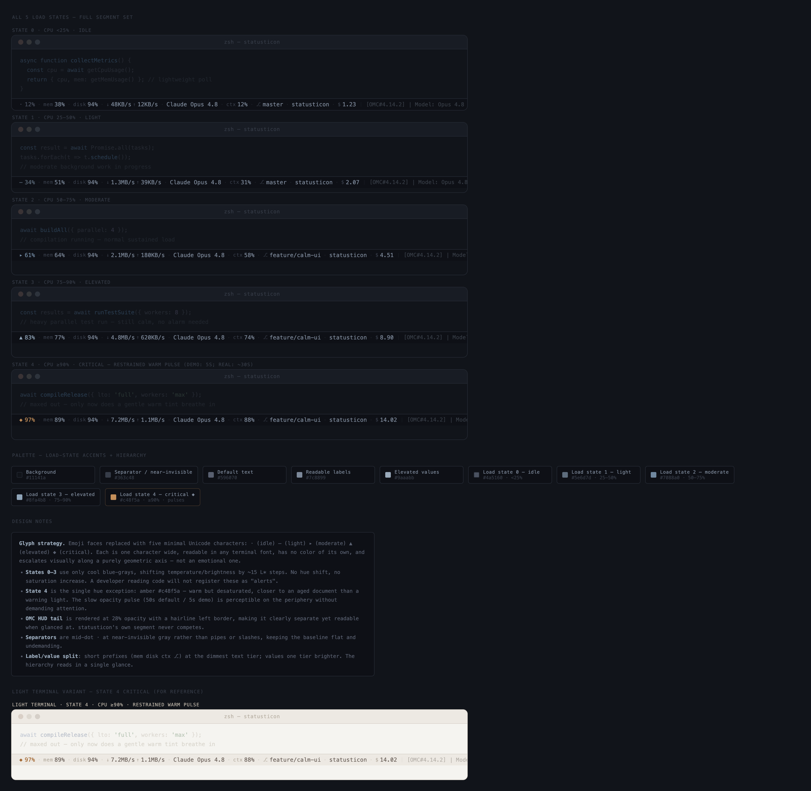

# understatus

A calm, unobtrusive statusline addon for Claude Code — live CPU, memory, battery, disk, network, and AI session info in a permanent bottom bar that stays out of your way.



---

## Why

Most statusline widgets are noisy. understatus is designed around one principle: **permanent visibility without distraction**.

- **Calm glyph theme** — load stages render as `○ ▁ ▄ ▆ ◆`. Color touches the glyph only; numeric values stay uncolored. Labels and separators are dimmed. At ≥90% CPU the critical glyph `◆` breathes slowly in restrained terracotta (`#b87848` ↔ `#7a5030`) — not red, not flashing.
- **Reactive CPU** — every render takes two snapshots ~25 ms apart and computes true instantaneous CPU% across all cores. No stale load-average guessing.
- **Non-destructive chaining** — `understatus install` detects your existing `statusLine.command`, preserves it in config, and chains it. `uninstall` restores byte-for-byte. Your current setup is never lost.

> **macOS only.** Apple Silicon (arm64) + Intel (x86\_64). Linux is not supported.

---

## Install

### Homebrew (recommended)

```bash
brew install ictechgy/understatus/understatus
```

> The formula lives in the tap `ictechgy/understatus` (repo: `ictechgy/homebrew-understatus`).

### Cargo

```bash
cargo install understatus
```

Requires Rust 1.75+.

### npm

```bash
npm install -g understatus
```

The npm package shells out to the prebuilt macOS binary for your architecture (arm64 / x64). macOS only.

### From source

```bash
git clone https://github.com/ictechgy/understatus.git
cd understatus
cargo build --release
# binary at ./target/release/understatus
```

---

## Setup

### Install into Claude Code

```bash
understatus install
```

This patches `~/.claude/settings.json` non-destructively:

1. Reads your current `statusLine.command` (if any).
2. Saves it as `chain_command` in `~/.config/understatus/config.toml`.
3. Replaces `statusLine.command` with the understatus binary path.
4. Injects `"refreshInterval": 5` (sourced from `config.toml [refresh].interval_seconds`).

### Uninstall

```bash
understatus uninstall
```

Restores `statusLine.command` and `refreshInterval` to their exact pre-install state. If `refreshInterval` was absent before install, the key is deleted.

---

### ⚠️ Global side-effect: `refreshInterval = 5`

`understatus install` writes `"refreshInterval": 5` into `settings.json`. This value applies to the **entire** statusLine subsystem — not just understatus:

- understatus itself spawns as a new process every 5 seconds.
- Any **chained command** (e.g. `lterm-omc-hud.mjs`) is also re-executed every 5 seconds.

To decouple heavy chain children, understatus caches their stdout via `chain_cache_ttl_seconds` (default 10 s). The chained child re-spawns at most once per TTL — not every 5 s.

**To save battery on laptops**, raise the interval:

```toml
# ~/.config/understatus/config.toml
[refresh]
interval_seconds = 10   # default: 5
```

Note: increasing `interval_seconds` proportionally slows the terracotta breath animation. Adjust `pulse_period_seconds` accordingly to keep it smooth (`pulse_period / interval >= 6`).

`understatus uninstall` reverts `refreshInterval` precisely — no residue left behind.

---

## Configuration

File: `~/.config/understatus/config.toml`  
All keys are optional; omitting a key uses its default.

| Key | Default | Description |
|-----|---------|-------------|
| `[cpu] sample_window_ms` | `25` | Interval (ms) between the two CPU snapshots. Larger = less noise, more latency. |
| `[cpu] load_glyphs` | `["○","▁","▄","▆","◆"]` | Glyphs for idle→critical load stages. Color is applied to the glyph only. To restore the original emoji theme: `["😌","🙂","😅","🥵","🔥"]`. |
| `[pulse] pulse_on_threshold` | `90` | CPU% at which the critical glyph starts breathing. |
| `[pulse] pulse_off_threshold` | `80` | CPU% below which the breath turns off (hysteresis). |
| `[pulse] pulse_period_seconds` | `30` | One full breath cycle in seconds. Keep `period / interval_seconds >= 6` for smooth animation. |
| `[pulse] pulse_style` | `"calm"` | `"calm"` = fixed glyph shape + terracotta brightness breath (hue never changes). `"bold"` = legacy style. |
| `[chain] chain_command` | `""` | Populated by `install`. The command that runs alongside understatus. |
| `[chain] order` | `"self_first"` | `"self_first"` or `"chain_first"` — which output appears on the left. |
| `[chain] chain_cache_ttl_seconds` | `10` | How long (s) to cache the chained command's stdout before re-spawning it. |
| `[chain] chain_timeout_ms` | `500` | Max ms to wait for the chained command. On timeout, cached or empty output is used. |
| `[display] max_width` | `80` | Maximum character width. Lower-priority segments are omitted when exceeded. |
| `[display] show_model` | `true` | Show Claude model name. |
| `[display] show_cost` | `true` | Show cumulative session cost. |
| `[display] show_context` | `true` | Show context usage %. Omitted automatically when null. |
| `[display] show_git` | `true` | Show git branch (derived from `workspace.git_worktree` / repo). |
| `[display] show_battery` | `true` | Show battery (IOKit, 30 s TTL cache). Silently omitted on desktops. |
| `[display] show_disk` | `true` | Show disk usage via `statfs("/")`. |
| `[display] show_network` | `true` | Show network throughput (getifaddrs counter delta). First render has no delta — omitted silently. |
| `[color] mode` | `"auto"` | `"auto"` \| `"truecolor"` \| `"256"` \| `"none"`. Respects `NO_COLOR`. |
| `[color] band_tints` | see below | Five hex colors for idle→critical glyph tint. Defaults: cool blue-grey ladder + terracotta at index 4. |
| `[color] pulse_palette` | `["#b87848","#7a5030"]` | High/low terracotta brightness for the breath animation. |
| `[color] label_color` | `"#6b7280"` | Dimmed color for labels, units, arrows, and git marker. |
| `[color] separator` | `" · "` | Segment separator string. |
| `[color] separator_color` | `"#3b4048"` | Color for separator and HUD seam. |
| `[color] hud_seam` | `"│"` | Character placed between understatus output and the chained command output. |
| `[refresh] interval_seconds` | `5` | Value written to `settings.json` as `refreshInterval`. ⚠️ Global side-effect — see above. |

**Default `band_tints`** (cool blue-grey brightness ladder, warm terracotta only at critical):

```toml
band_tints = ["#5a6878", "#6d8296", "#86a0b4", "#9fbfce", "#b87848"]
```

---

## How it works

```
Claude Code  (every refreshInterval seconds)
   │  stdin: one JSON line
   ▼
understatus binary  (new process per call — no daemon, no state files, no locks)
   ├─ parse stdin  → ClaudeInput
   ├─ double-sample CPU  → cpu_percent (0–100%, average across all cores)
   │     on failure → loadavg fallback: min(load1 / ncpu × 100, 100)
   ├─ memory (host_statistics64)
   ├─ battery (IOKit, 30 s TTL cache)        ← omitted on desktops
   ├─ disk    (statfs("/"))
   ├─ network (getifaddrs counter delta)     ← omitted on first render
   ├─ glyph + band tint (color on glyph only)
   │   at ≥90% CPU → terracotta brightness breath on ◆
   ├─ chain_command child (TTL cache + 500 ms timeout)
   └─ compose → stdout (single newline)
```

**CPU measurement:** Two `/proc`-equivalent snapshots are taken ~25 ms apart within the same process invocation. The delta gives true instantaneous utilization — not a smoothed load average. If the syscall fails (rare), `loadavg` serves as a silent fallback.

**Glyph + tint design:** `band_tints[0..3]` are cool blue-grey values of increasing brightness (idle to high load). `band_tints[4]` is the lone warm color — terracotta — reserved for the critical stage. Only the glyph character receives color; all numeric values and labels stay uncolored.

**Terracotta breath:** When CPU stays at ≥90%, the `◆` glyph cycles between `pulse_palette[0]` (brighter terracotta) and `pulse_palette[1]` (darker terracotta) over `pulse_period_seconds`. Hue never shifts — only brightness. This is the `"calm"` pulse style.

---

## CLI Support Matrix

| CLI | Status | Notes |
|-----|--------|-------|
| **Claude Code** | ✅ Full support | Custom `statusLine.command`, stdin JSON, `refreshInterval` (default 5 s) — all supported. |
| **Gemini CLI** | ⏳ Stub / forward-looking | `/footer` and `/statusline` expose built-in items only; custom commands not yet supported (open issue). |
| **Codex CLI** | ⏳ Stub / forward-looking | `[tui].status_line` is a fixed built-in; custom commands not yet supported (open issue). |

Gemini and Codex integration is documented and stubbed (`CliAdapter` trait planned) but not yet functional — those CLIs do not currently expose a custom statusline command hook.

---

## Platform

- **macOS only.** Uses `host_processor_info`, `host_statistics64`, and `IOPSCopyPowerSourcesInfo` — all macOS-specific APIs.
- **Apple Silicon (arm64) + Intel (x86\_64).** Tested on macOS arm64 with a 12-core Apple Silicon chip.
- Linux: builds may succeed, but CPU double-sampling degrades silently to loadavg fallback. Not a supported target.
- **Rust edition 2021, MSRV 1.75+.**

---

## License

MIT — see [LICENSE](LICENSE).

---

## 한국어 안내

macOS용 AI 코딩 CLI statusline 애드온입니다. CPU%, 메모리, 배터리, 디스크, 네트워크, AI 세션 정보(모델명·비용·컨텍스트)를 Claude Code 하단 표시줄에 조용하고 자연스럽게 표시합니다.

**주요 특징**

- **절제된 글리프 테마** — 부하 단계: `○ ▁ ▄ ▆ ◆`. 색은 글리프에만, 숫자 값은 무색, 라벨·구분자는 디밍. CPU ≥90%에서만 `◆`가 테라코타 명도 호흡(`#b87848`↔`#7a5030`).
- **반응형 CPU** — 매 렌더마다 두 스냅샷(~25ms 간격) 직접 측정. loadavg 아님.
- **비파괴 설치** — 기존 `statusLine.command`를 체이닝으로 보존하고 정확히 복원.

**설치**

```bash
# Homebrew
brew install ictechgy/understatus/understatus

# Cargo
cargo install understatus

# npm
npm install -g understatus
```

**Claude Code에 적용**

```bash
understatus install   # ~/.claude/settings.json 패치 (비파괴)
understatus uninstall # 원상 복원
```

> ⚠️ `install`은 `settings.json`에 `"refreshInterval": 5`를 전역 주입합니다. 체이닝된 기존 명령도 5초마다 재실행 대상이 됩니다. 배터리 절약이 필요하면 `config.toml`에서 `interval_seconds = 10`으로 올리세요.

설정 파일: `~/.config/understatus/config.toml` (없으면 모두 기본값)

기존 이모지 테마 복원: `config.toml`에서 `load_glyphs = ["😌","🙂","😅","🥵","🔥"]`

macOS 전용 · Apple Silicon(arm64) + Intel(x86\_64) · Rust 1.75+ · MIT 라이선스
